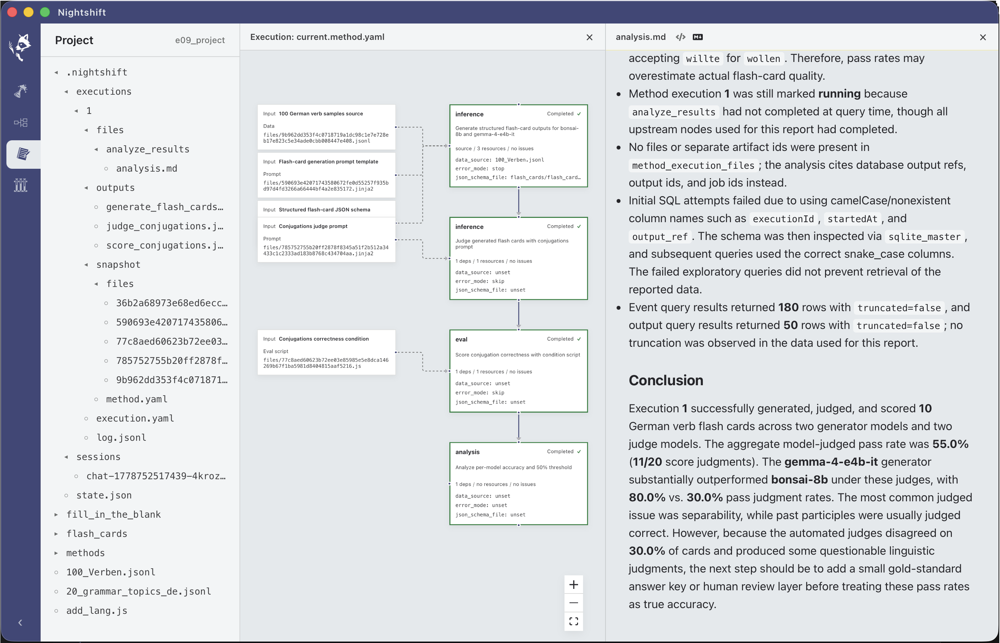
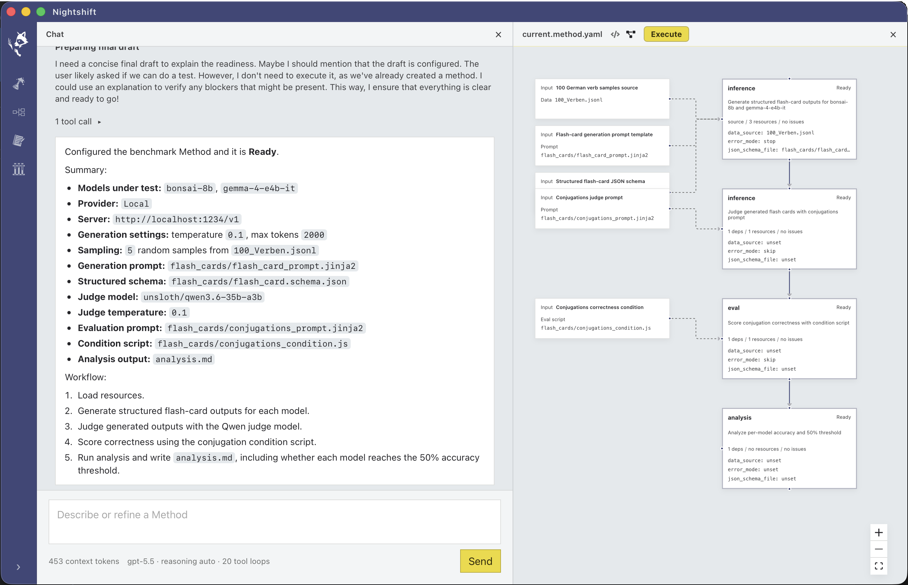

# nightshift

This is an agentic harness to build reproducible LLM experiments and benchmarks. I built this to automate the experiment effort I was spending [to evaluate local models for language learning content](https://github.com/alexbrjo/llm-language-quiz-experiments).

  

## I want to use this!

You're welcome to download the source and build it, but note that this project is in a pre-release state. This means I am pushing straight to main and I do not guarantee the stability of APIs/data formats. If/when I do a release on github, the development process and stability contracts will change.

## Credits

Sidebar icons are from [Game Icons](https://game-icons.net/) by [Lorc](https://lorcblog.blogspot.com/), [Delapouite](https://delapouite.com/), and contributors, licensed under [CC BY 3.0](https://creativecommons.org/licenses/by/3.0/). The main logo (raccoon putting on gloves) was made using GPT Image 2.0 and a basic image editor.
